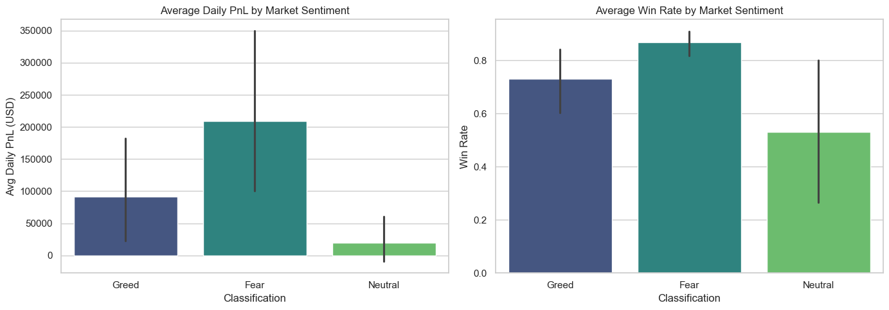
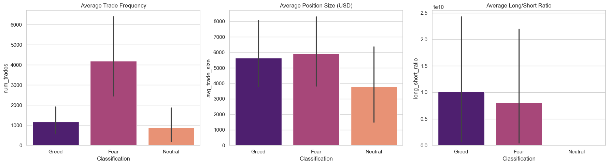
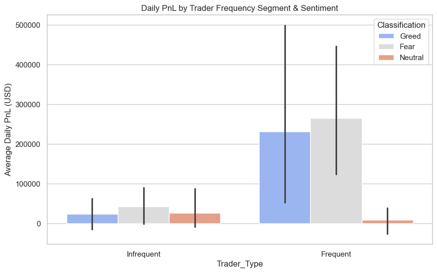
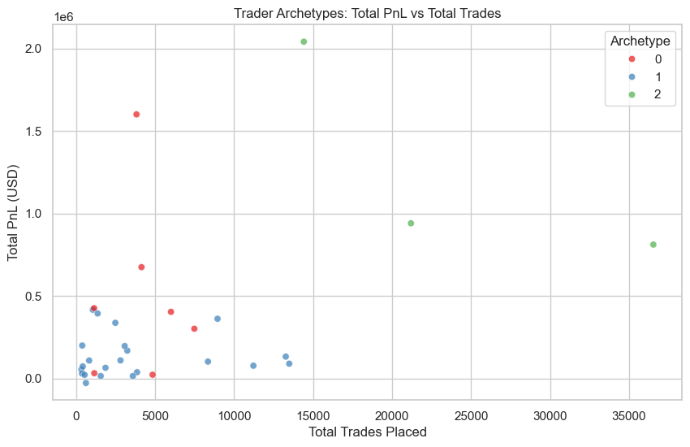
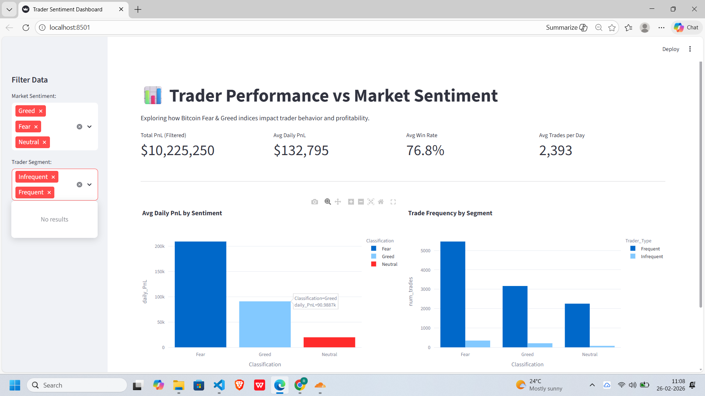
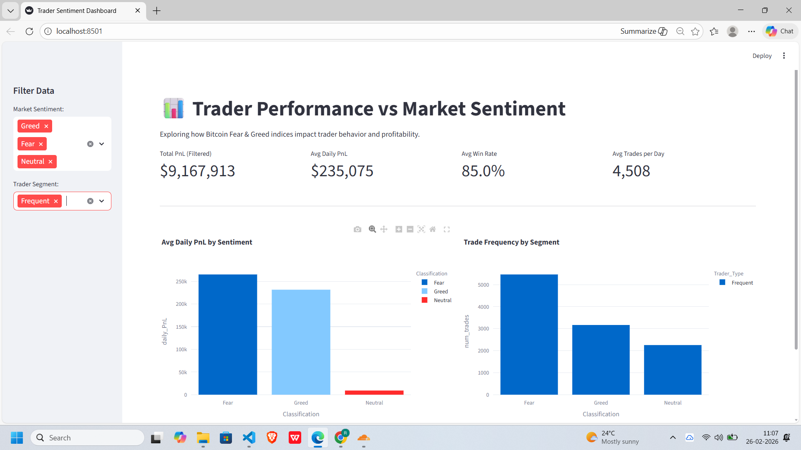
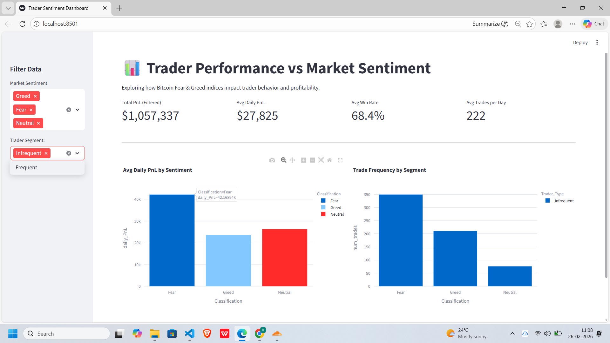

# 📊 Hyperliquid Trader Behavior vs. Market Sentiment

This repository contains a comprehensive analysis of the correlation between the Bitcoin **Fear & Greed Index** and trader performance on the **Hyperliquid DEX**. 

## 📂 Repository Structure

- **`assignment.ipynb`**: Main research notebook covering data cleaning, exploratory analysis (EDA), and machine learning (K-Means clustering).
- **`app.py`**: Interactive Streamlit dashboard for real-time data exploration.
- **`processed_metrics.csv`**: Aggregated dataset generated by the analysis.
- **`requirements.txt`**: List of dependencies (Pandas, NumPy, Seaborn, Scikit-Learn, Streamlit, Plotly).
- **`outputs/`**: Folder containing generated plots and analysis results.
  - `Performance.png` → Average Daily PnL & Win Rate by Sentiment
  - `Behaviour.png` → Trade Frequency, Position Size, Long/Short Ratio
  - `Segmentation.png` → Daily PnL by Trader Segment & Sentiment
  - `clustering.png` → Trader Archetypes visualization
- **`images/`**: Folder containing screenshots for README and dashboard.
  - `dashboard_overview.png` → Dashboard overview with KPIs
  - `dashboard_frequent.png` → Frequent trader segment view
  - `dashboard_infrequent.png` → Infrequent trader segment view


---

## Setup & Execution

**1. Clone the repository**
```bash
git clone [https://github.com/RajaswiBorkar15/hyperliquid-sentiment-analysis.git](https://github.com/RajaswiBorkar15/hyperliquid-sentiment-analysis.git)
cd hyperliquid-sentiment-analysis
```
**2. Install dependencies**
```bash
pip install -r requirements.txt
```
**3. Run the notebook**
Open assignment.ipynb in Jupyter Notebook or VS Code to reproduce the analysis.

**4.Launch the dashboard**
```bash
streamlit run app.py
```

## 🛠 Methodology

### Data Preparation
- Loaded Fear & Greed sentiment data and Hyperliquid trade data.
- Checked dataset shapes, missing values, and duplicates.
- Converted timestamps to daily granularity.
- Standardized sentiment labels (Extreme Fear → Fear, Extreme Greed → Greed).
- Merged datasets on Date.
- Computed daily trader metrics: PnL, win rate, average trade size, number of trades, long/short ratio.
- Classified traders into **Frequent vs Infrequent** segments.

### Analysis
- Compared performance (PnL, win rate) across **Fear vs Greed days**.
- Examined behavioral shifts (frequency, position size, bias).
- Segmented traders into archetypes using **K-Means clustering**.

### Visualization
- Bar charts for average PnL, win rate, trade frequency.
- Scatter plots for win rate vs PnL.
- Clustering visualization of trader archetypes.

---

## 🔑 Key Insights
1. **Fear days concentrate PnL among active traders** — frequent traders often capture outsized gains.  
2. **Win rate alone is not predictive of profitability** — trade sizing and exposure drive PnL variance.  
3. **Behavior shifts by sentiment** — some traders increase trade size on Fear days, others increase frequency.

---

## 🚀 Strategy Recommendations
- **Rule A (Frequent traders):** Reduce leverage on Greed days; increase position sizing selectively on Fear days.  
- **Rule B (Infrequent traders):** Use smaller, higher-probability trades on Greed days; opportunistic larger positions only on Fear days with clear signals.

---

## 🎯 Bonus Features
- **Trader Archetypes:** Clustered accounts into 3 behavioral groups (high-volume, opportunistic, conservative).  
- **Streamlit Dashboard:** Interactive filters for sentiment and trader type, with KPIs and charts.  
- **Predictive Modeling (optional):** Framework for next-day profitability prediction using sentiment + behavior features.

---

## 📊 Outputs & Visuals

### Performance Analysis


### Behavior Changes


### Segmentation


### Trader Archetypes (K-Means Clustering)


---

## 📸 Dashboard Screenshots
### Overview


### Frequent Trader Segment


### Infrequent Trader Segment



---

## 📝 Deliverables
- Jupyter Notebook (`assignment.ipynb`)  
- Processed dataset (`processed_metrics.csv`)  
- Streamlit dashboard (`app.py`)  
- This README.md (methodology, insights, strategy recommendations)

